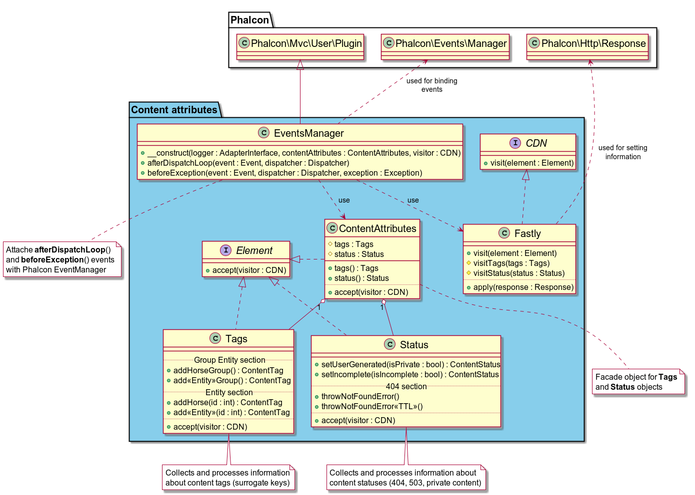

# Content attributes

We agreed to use this component to handling situations like:
* page tagging on each page (Fastly surrogate keys)
* some of the information on the page is not available due to an internal error (503 service unavailable)
* UGC (user generated content)
* incorrect request or information not found (404 page not found)

We allow content owners to manage their content output and behaviour. It means that content owner can generate 404 response, 
503 response and mark content as a UGC via specific interface. The basic idea of this solution is based on the 
introduction of a new specific interface.

This interface allows us to hide a real implementation (and in general business rules for such cases) from content owner. 
We will hide a CDN (Fastly) specific instruction inside this component too.
Final solution will be decided in this specific component.

Table of contents

1. [Installation](#installation)
2. [Usage](#usage)
 * [Handling content status](#status)
 * [Handling content tags](#tags)
3. [Product surrogate key](#product) 
4. [Component structure](#structure)

## <a name="installation"></a>Installation

1. Add the ContentAttributes component to `composer.json`
```json
{
    "require": {
      ...
      "rp/content-attributes" : "^1.0"
    }
}
```

2. Delete usage of 404 component
```json
{
    "require": {
      ...
      "minitrue/page404component": "0.0.*", //<-- delete this code
      ...
    }
}
```

3. Update Cache Legacy component to version 2 or higher
```json
{
    "require": {
      ...
      "teamone/cache-legacy" : "^2.0.0",
      ...
    }
}
```

4. Change namespace for ```LifeTime``` class from ```RP\Cache\Core\Service\LifeTime``` to ```RP\Cache\LifeTime```

5. Pass `ContentAttributes` to DI in `src/php/config/services.php`:
```php
<?php
// ...

/**
 * Content Attributes
 */
$di->setShared('contentAttributes', '\RP\ContentAttributes\Element\ContentAttributes');
```

6. Create new file `src/php/config/content.php`
```php
<?php
/**
 * @var \Phalcon\DI\FactoryDefault $di
 */
new RP\ContentAttributes\EventsManager(
    $di->getShared('logger'),
    $di->getShared('contentAttributes'),
    new \RP\ContentAttributes\CDN\Fastly(
        $di->getShared('logger')
    )
);
```
For progects not contain View as part of Application need to use
```php
<?php
new RP\ContentAttributes\ApiEventsManager(
    $di->getShared('logger'),
    $di->getShared('contentAttributes'),
    new \RP\ContentAttributes\CDN\Fastly(
        $di->getShared('logger')
    )
);
```

7. Update your index.php `public/index.php`

```php
<?php

//...

/**
 * Load application services
 */
include PATH_PHP_SRC . '/config/services.php';

//...

/**
 * ContentAttributes initialization
 */
include PATH_PHP_SRC . '/config/content.php';

/**
 * Cache initialization
 */
include PATH_PHP_SRC . '/config/cache.php';

//...
```

8. Delete usage of 404 component in your index.php `public/index.php`
```php
<?php

/**                                         // <-- delete this code
 * Handle not found                         // <-- delete this code
 */                                         // <-- delete this code 
//include PATH_PHP_SRC . '/config/404.php'; // <-- delete this code
```

## <a name="usage"></a>Usage

### <a name="status"></a>Handling content status

Q: How we will manage situation with page/request when some of the information is not available due to an internal error?

A: You should mark your page/request as content with missed information via calling ```$contentAttributes->status()->setIncomplete(true)```.

In this case you will get:
* **User** will see a “normal” page (not 404) with some missed content and 503 status.
* **RP Local (file) cache** will be not created
* **CDN (Fastly) cache** will be created to TTL 20 seconds (for example)

```php
<?php
/**
 * My controller
 *
 * @package RP\Controllers
 *
 * @property \RP\ContentAttributes\Element\ContentAttributes $contentAttributes 
 */
class MyController extends Controller
{
    /**
     * My action.
     */
    public function myAction()
    {
        // ...
        
            try {
                /**
                 * @var \RP\Homepage\Models\Collections\StoryCollection $news
                 */
                $news = $requestNews
                    ->getResponse(ApiRequest::RETURN_OBJECT)
                    ->getNews();

                $news->limitStories(40);
                $this->view->isProminent = $news->isProminent();
                $this->view->generalStories = $news->getStories();
            } catch(\Exception $e) {
                // Mark page as page with missed information
                $this->contentAttributes->status()->setIncomplete(true);
            
                $this->view->isProminent = false;
                $this->view->generalStories = [];
            }        
        
        // ...
    }
```

Q: How we will manage situation with page/request when we have a user generated content?

A: You should mark your page/request as content with UGC information ```$contentAttributes->status()->setUserGenerated(true)```.

In this case you will get:
* **User** will see a UGC content 
* **RP Local (file) cache** will be not created
* **CDN (Fastly) cache** will be not created

```php
<?php

/**
 * Class UgcController
 * @package RP\Controllers
 *
 * @property \RP\ContentAttributes\Element\ContentAttributes $contentAttributes
 */
class UgcController extends BaseController
{
    /**
     * Index action.
     */
    public function indexAction()
    {
        // Mark page as UGC
        $this->contentAttributes->status()->setUserGenerated(true);
        // ...
    }

```

Q: How we will manage situation with incorrect request or information not found?

A: You should mark your page/request as incorrect via calling ```$contentAttributes->status()->throwNotFoundError()```.

In this case you will get:
* **User** will see a 404 page 
* **RP Local (file) cache** will be not created
* **CDN (Fastly) cache** will be created to TTL 20 seconds (for example)
```php
<?php

/**
 * Class UgcInfoge RP\Controllers
 *
 * @property \RP\ContentAttributes\Element\ContentAttributes $contentAttributes
 */
class InfoController extends BaseController
{
    /**
     * Index action.
     */
    public function indexAction()
    {
        // ... 
        try {
            $pageResponse = $this->di->getShared('api')
                                     ->createRequest(ApiRequestTypes::TYPE_RESULTS_FAST)
                                     ->setId($id)
                                     ->getResponse(\RP\Utils\Api\ApiRequest::RETURN_ARRAY);
        } catch (\Exception $e) {
            // Mark page as 404 page
            $this->contentAttributes->status()->throwNotFoundError();
        }

    }  
```

Please review family of methods `throwNotFoundError` and use the most suitable.

|Method name|Cache TTL|Server variable name|
|---|---|---|
|throwNotFoundError()|LifeTime::PAGE_404|CTRL_CACHE_TTL_SEC_PAGE_404|
|throwNotFoundErrorNoExpire()|LifeTime::NO_EXPIRE|CTRL_CACHE_TTL_SEC_NOEXPIRE|
|throwNotFoundErrorLong|LifeTime::LONG|CTRL_CACHE_TTL_SEC_LONG|
|throwNotFoundErrorMedium|LifeTime::MEDIUM|CTRL_CACHE_TTL_SEC_MEDIUM|
|throwNotFoundErrorShort|LifeTime::SHORT|CTRL_CACHE_TTL_SEC_SHORT|
|throwNotFoundErrorZero|LifeTime::ZERO|CTRL_CACHE_TTL_SEC_ZERO|

### <a name="tags"></a>Handling content tags

You have ability to mark your content by such groups and single tags. All your tags will be used by EMS and Cache Manager to manage page caches.

|Name|Mark your content by Group tag|Mark your content by Single tag|Description|
|---|---|---|---|
|Bloodstock|addBloodstockGroup()|addBloodstock(id)|used for tagging pages with "Bloodstock" content|
|Card|addCardGroup()|addCard(id)|used for tagging pages with "Card" content|                               
|Course|addCourseGroup()|addCourse(id)|used for tagging pages with "Course" content|                         
|Catalogue|addCatalogueGroup()|addCatalogue(id)|used for tagging pages with "Catalogue" content|                
|Dog|addDogGroup()|addDog(id)|used for tagging pages with "Dog" content|
|Dog owner|addDogOwnerGroup()|addDogOwner(id)|used for tagging pages with "Dog owner" content|
|Dog trainer|addDogTrainerGroup()|addDogTrainer(id)|used for tagging pages with "Dog trainer" content|
|Dam|addDamGroup()|addDam(id)|used for tagging pages with "Dam" content|                                  
|European|addEuropeanGroup()|-|used for tagging pages with "European" content|                   
|Entry|addEntryGroup()|-|used for tagging pages with "Entry" content|                   
|Horse|addHorseGroup()|addHorse(id)|used for tagging pages with "Horse" content|                            
|Jokey|addJokeyGroup()|addJokey(id)|used for tagging pages with "Jokey" content|                            
|News|addNewsGroup()|addNews(id)|used for tagging pages with "News" content|                               
|News section|addNewsSectionGroup()|addNewsSection(id)|used for tagging pages with "News Section" content|                               
|Owner|addOwnerGroup()|addOwner(id)|used for tagging pages with "Owner" content|                            
|Profile|addProfileGroup()|addProfile(id)|used for tagging pages with "Profile" content|                      
|Relatives|addRelativesGroup()|addRelatives(id)|used for tagging pages with "Relatives" content|                
|Result|addResultGroup()|addResult(id)|used for tagging pages with "Result" content|                         
|Sale|addSaleGroup()|-|used for tagging pages with "Sale" content|                         
|Stallion|addStallionGroup()|addStallion(id)|used for tagging pages with "Stallion" content|                   
|Sire|addSireGroup()|addSire(id)|used for tagging pages with "Sire" content|                               
|Season|addSeasonGroup()|addSeason(id)|used for tagging pages with "Season" content|                         
|Statistics|addStatisticsGroup()|-|used for tagging pages with "Statistics" content|             
|Track|addTrackGroup()|addTrack(id)|used for tagging pages with "Track" content|                            
|Trainer|addTrainerGroup()|addTrainer(id)|used for tagging pages with "Trainer" content|                      
|Upcoming|addUpcomingGroup()|addUpcoming(id)|used for tagging pages with "Upcoming" content|                   
|Vendor|addVendorGroup()|addVendor(id)|used for tagging pages with "Vendor" content|     
|Venue|addVenueGroup()|addVenue(id)|used for tagging pages with "Venue" content|     
|Sold|addSoldGroup()|-|used for tagging pages with "Sold" content|     
|News media|-|addNewsMedia(id)|used for tagging pages with "News Media" content| 
|Advertising|addAdvertisingGroup()|addAdvertising(pageId, id)|used for tagging pages with "Advertising" content| 
|Naps Table |addNapsTableGroup()|used for tagging pages with "Naps Table" content| 
|Press Challenge |addPressChallengeGroup()|used for tagging pages with "Press Challenge" content| 
|Non Runners |addNonRunnersGroup()|used for tagging pages with "Non Runners" content| 

```php
<?php
/**
 * My controller
 *
 * @package RP\Controllers
 *
 * @property \RP\ContentAttributes\Element\ContentAttributes $contentAttributes 
 */
class MyController extends Controller
{
    /**
     * My action.
     */
    public function myAction($cardId)
    {
        // ...

        $this->contentAttributes->tags()
            ->addCardGroup()    // Add Card group tag
            ->addJockeyGroup()  // Add Jockey group tag
            ->addCard($cardId)  // Add tag for card with id equals to value of $cardId
            ->addHorseGroup();  // Add Horse group tag
        
        // ...
    }
```
As result, this page will be marked as part of such groups:
* Card
* Jockey
* Horse

and as part of single mark:
* Card 

EMC and Cache Manager can find and manipulate of cache for this page with 3 groups (Card, Jockey and Horse) and one single tag (Card id).

## <a name="product"></a>Product surrogate key
This special surrogate key has been added in version 1.9.0 and allowed you to mark your pages as pages related to particular product. This key in very useful for purging all Fastly cache related to particular product. It has been requested by Operation team. You should define special constant `PRODUCT_ID` in your index.php file to set this key. Content attributes component will use it automatically.

>Product surrogate key will be set automatically to '**unknown**' if you did not define constant `PRODUCT_ID` in your product.
```php
<?php

...

define('PRODUCT_ID', 'homepage');

...
```

## <a name="structure"></a>Component structure
