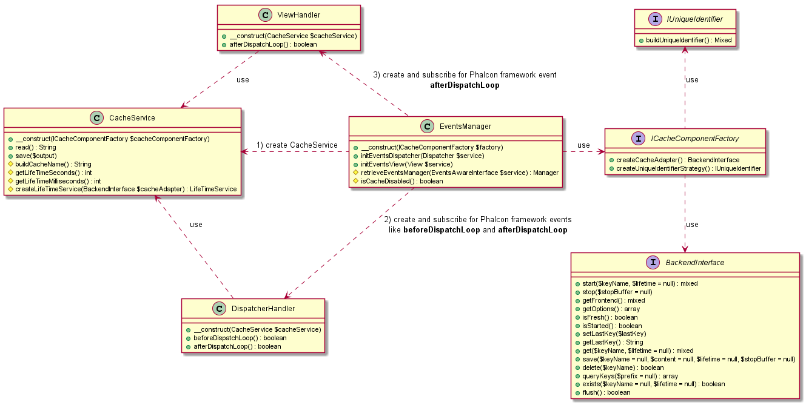

# Caching component

This package contains a basic approach of caching implementation for ALL NDP projects.

## Table of contents
1. [How to install](#s-0)
    1. [Install composer component](#s-0-0)
    2. [Update project's configuration](#s-0-1)
    3. [Create cache initialization file](#s-0-2)
    4. [Update application entry point](#s-0-3)
2. [FAQ](#s-1)
3. [UML diagram](#s-2)

# <a name="s-0"></a>How to install

__Important__: It's just an example of installation. This package can't be used by itself only.
    
## <a name="s-0-0"></a>Install composer component

<code>$ composer require teamone/cache-core</code>

## <a name="s-0-1"></a>Update project's configuration

___file: lib\php\config\config.php___

```php
<?php
/**
 * @var Phalcon\Config\Adapter\Server $server
 */
$server = $di->getServerVars();

return new \Phalcon\Config([

    // ...

    'cache' => [
        'lifetime' => \RP\Cache\LifeTime::LONG,
        'rootDir' => $server->get('PATH_INT_WWW_CACHE_ROOT'),
    ],

    // ...

]);
```

List of predefined lifetime values retrieves from server variables you can find [here](https://stash.rp-dev.com/projects/SPC/repos/rp-cache-lifetime/browse#s-1)

## <a name="s-0-2"></a>Create cache initialization file

___file: lib\php\config\cache.php___

```php
<?php
/**
 * @var \Phalcon\DI\FactoryDefault $di
 */

$cacheEventsManager = new RP\Cache\Core\EventsManager(
    new RP\Cache\Core\Factory\CacheComponent(
        $config->cache->lifetime,
        $config->cache->rootDir
    ),
    $di->getDispatcher(),
    $di->getView()
);
```

__NOTE__: Instead of using ___RP\Cache\Core\Factory\CacheComponent___ example, you need to create your own cache factory that implements ___ICacheComponent___ interface.

## <a name="s-0-3"></a>Update application entry point

___file: public\index.php___

```php
<?php

// ...

/**
 * Setup cache
 */
include __DIR__ . "/../lib/config/cache.php";  // Put this line after including services.php

/**
 * Application init
 */
$application = new Application($di);

/**
 * Disable autorender
 */
$application->useImplicitView(false); // This line is highly important

/**
 * Handle the request
 */
echo $application->handle()->getContent();

// ...
```

# <a name="s-1"></a>FAQ
__Q__: Do you have an example of implementation of ___ICacheComponent___ interface?

__A__: Sure. If you want to see a example of implementation of ___ICacheComponent___ interface you need to check [teamone/cache-legacy](https://stash.rp-dev.com/projects/TO/repos/cache-legacy/browse) repository.


# <a name="s-2"></a>UML diagram

_OUTDATED_


